# HTTP Request Flows

Mermaid sequence diagrams for every major user action and background flow in the app.

**Participants used throughout:**
- **Browser** – the HTML page / audio element
- **app.js** – frontend JavaScript
- **FastAPI** – the Python backend
- **DB** – SQLite database
- **YT** – YouTube / yt-dlp / ffmpeg pipeline

---

## 1. Page Load

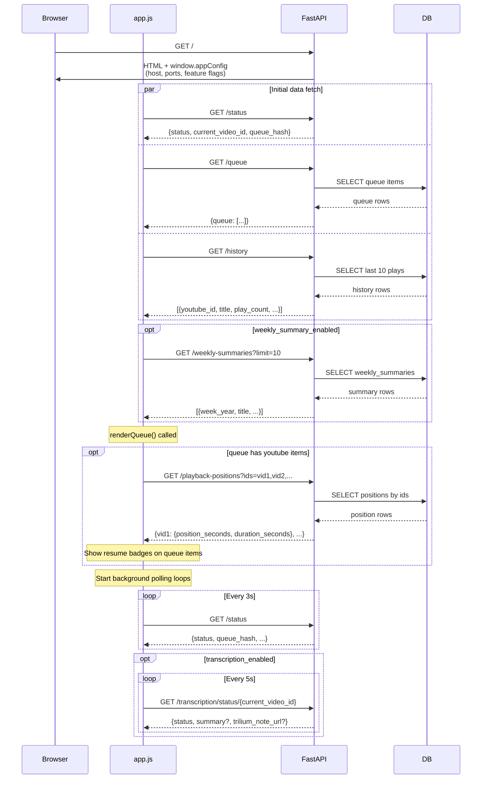

---

## 2. Add Video to Queue

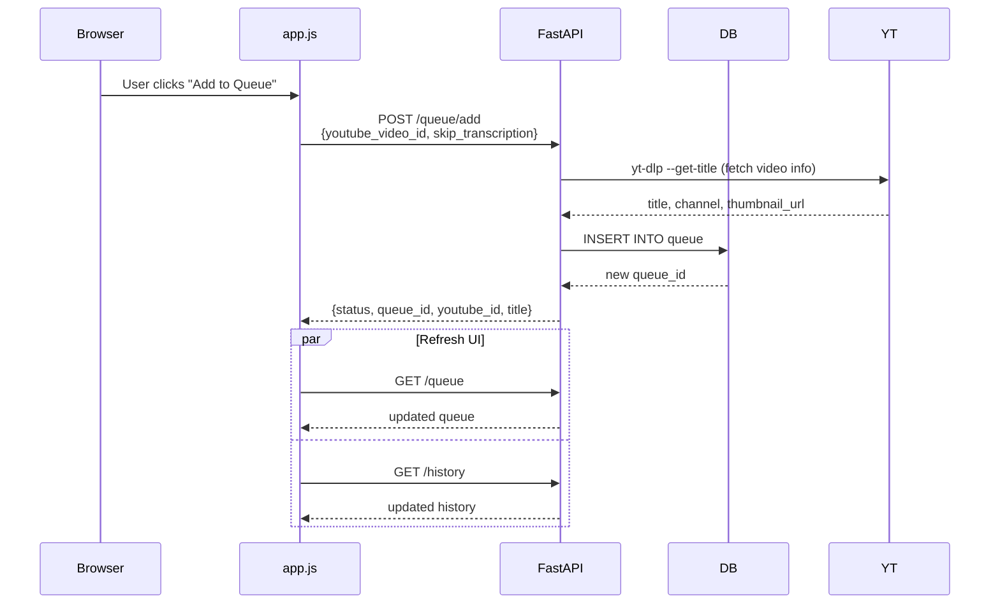

---

## 3. Play Queue (Start Playback)

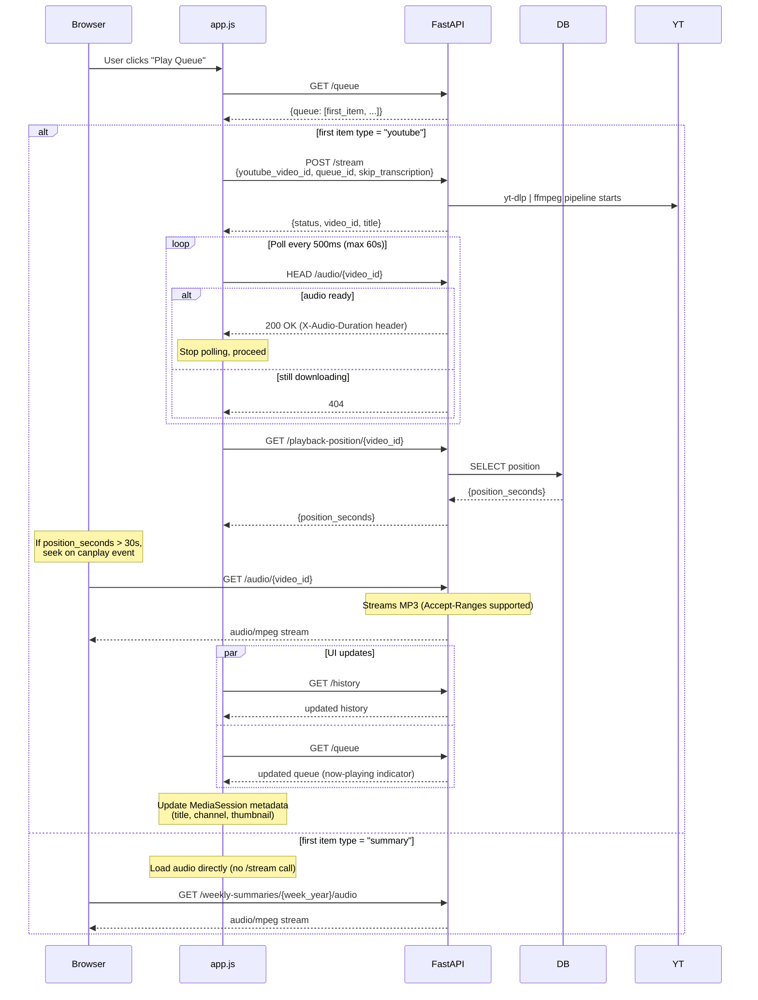

---

## 4. Active Playback Loop (always-on background)

```mermaid
sequenceDiagram
    participant Browser
    participant app.js
    participant FastAPI
    participant DB

    Note over app.js: Runs continuously during playback

    loop Every 10s (timeupdate throttled)
        app.js->>FastAPI: POST /playback-position/{video_id}<br/>{position_seconds, duration_seconds}
        FastAPI->>DB: INSERT OR REPLACE playback_positions
        Note over FastAPI: Fire-and-forget; errors ignored
    end

    loop Every 3s
        app.js->>FastAPI: GET /status
        FastAPI-->>app.js: {status, queue_hash, current_video_id}
        alt queue_hash changed
            Note over app.js: Another device modified queue
            app.js->>FastAPI: GET /queue
            FastAPI-->>app.js: updated queue
            Note over app.js: Refresh now-playing indicator
        end
    end

    loop timeupdate (every ~250ms)
        alt within prefetchThresholdSeconds of end
            app.js->>FastAPI: POST /queue/prefetch/{next_video_id}
            FastAPI-->>app.js: {status: "started"|"cached"|"downloading"}
            Note over app.js: Fire-and-forget (deduplicated by app.js flag)
        end
    end

    opt transcription_enabled
        loop Every 5s
            app.js->>FastAPI: GET /transcription/status/{video_id}
            FastAPI-->>app.js: {status, summary?, trilium_note_url?}
            Note over app.js: Update transcription status UI
        end
    end

    opt Tab becomes visible after being hidden
        app.js->>FastAPI: GET /status
        FastAPI-->>app.js: status
        app.js->>FastAPI: GET /queue
        FastAPI-->>app.js: queue
        opt player paused
            app.js->>FastAPI: GET /playback-position/{video_id}
            FastAPI-->>app.js: {position_seconds}
            alt drift > 15s
                Note over app.js: Seek to server position
            end
        end
    end
```

---

## 5. Track Ends Naturally

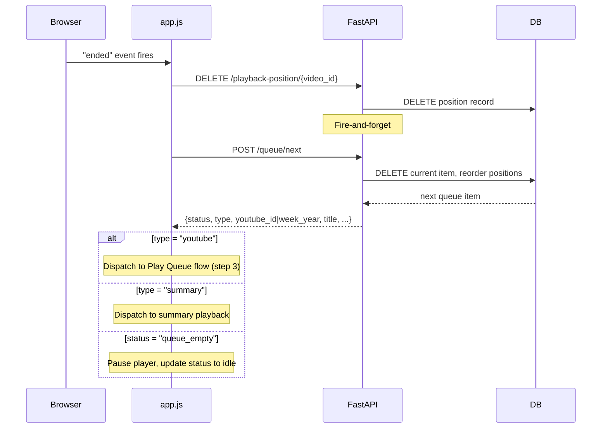

---

## 6. User Clicks Next

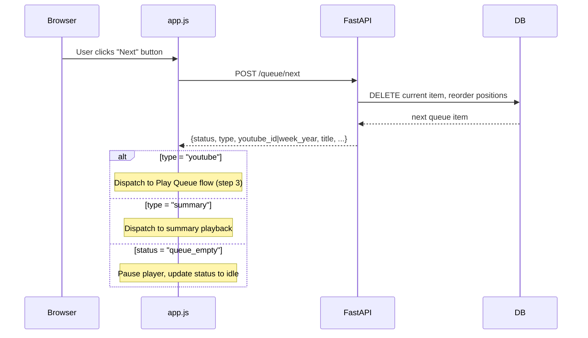

---

## 7. Stop Stream

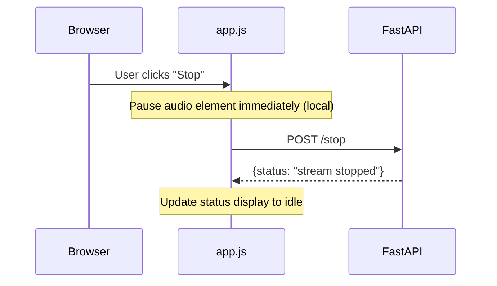

---

## 8. Remove from Queue

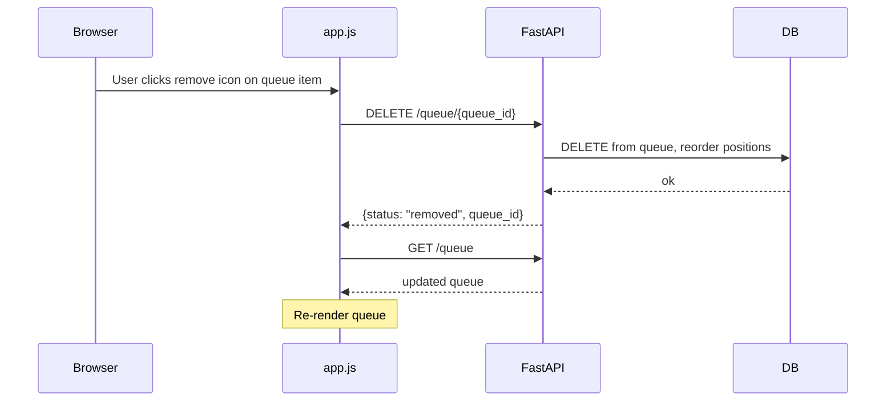

---

## 9. Clear Queue

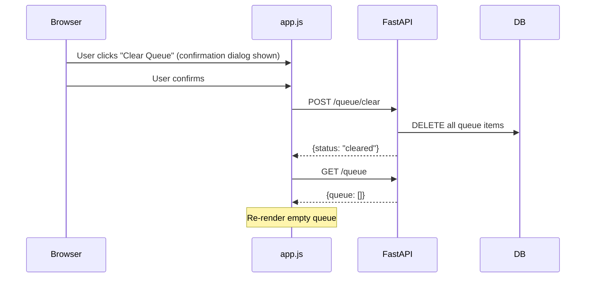

---

## 10. Reorder Queue (drag-and-drop)

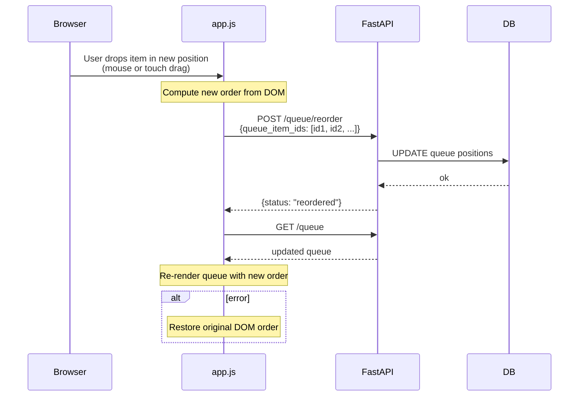

---

## 11. Smart Suggestions

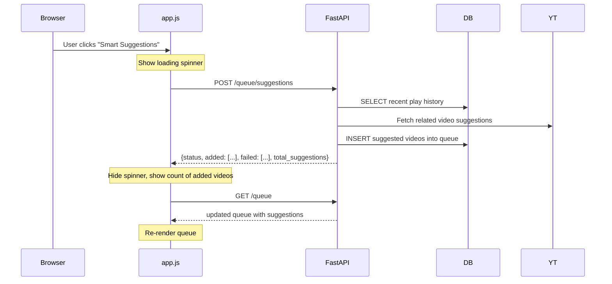

---

## 12. Clear History

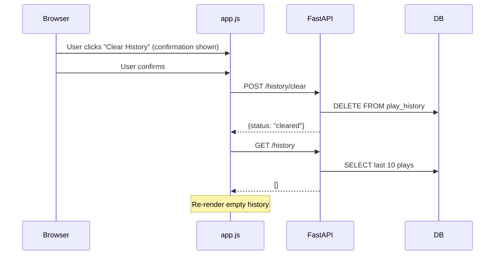

---

## 13. View Transcription Summary

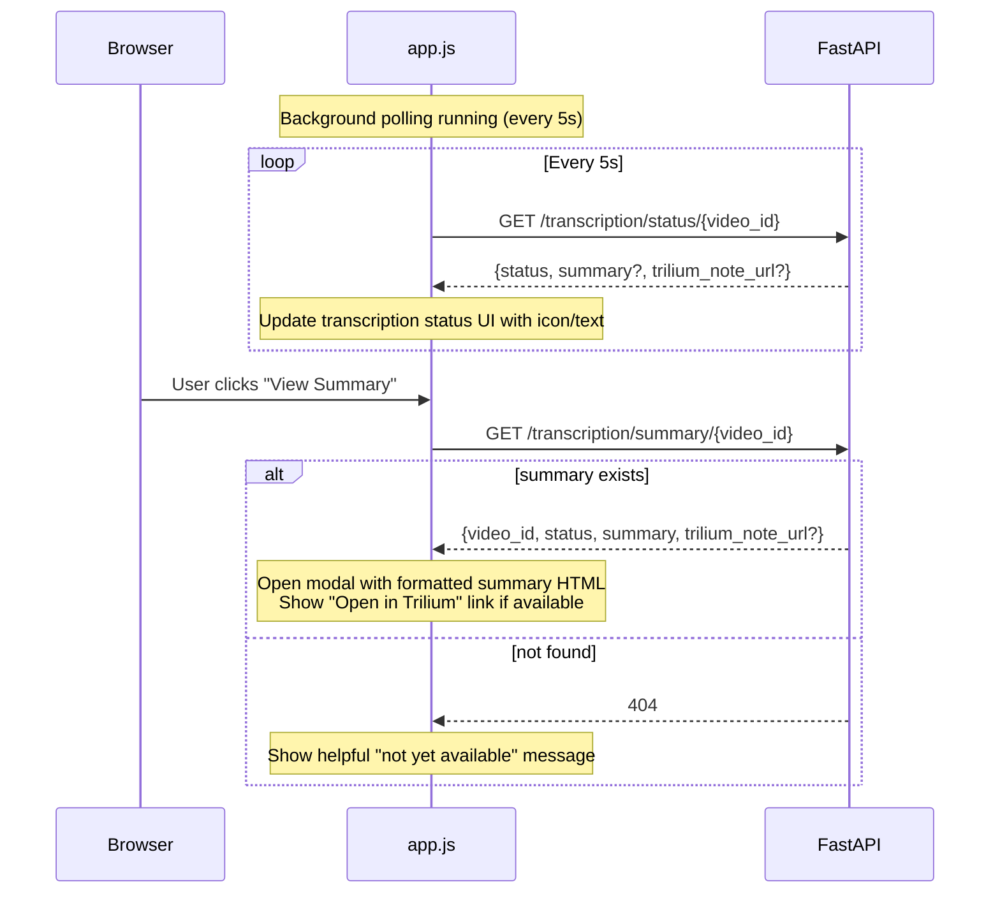

---

## 14. Weekly Summaries: Add to Queue / Play

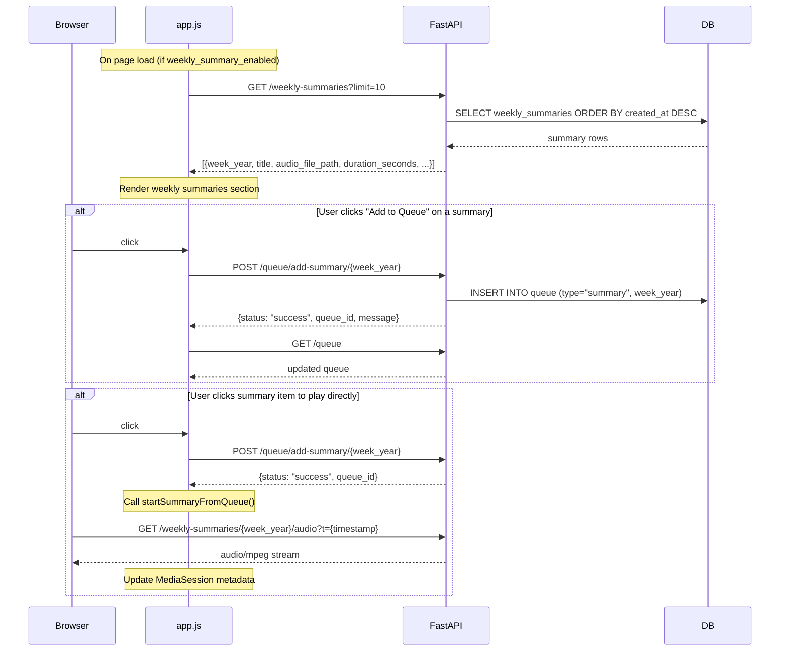

---

## 15. Client Log Flushing

```mermaid
sequenceDiagram
    participant app.js
    participant FastAPI

    Note over app.js: Logs accumulate in in-memory buffer<br/>via log(level, message, context)

    Note over app.js: On first log: schedule flushLogs()<br/>after LOG_BATCH_INTERVAL ms

    app.js->>FastAPI: POST /admin/client-logs<br/>[{level, message, timestamp, context}, ...]
    FastAPI-->>app.js: {status: "ok", received: count}
    Note over app.js: Clear buffer; schedule next flush if buffer non-empty

    alt Page unload (beforeunload)
        Note over app.js: navigator.sendBeacon() used for reliability<br/>POST /admin/client-logs (non-blocking)
    end
```

---

## 16. Admin Stats Page

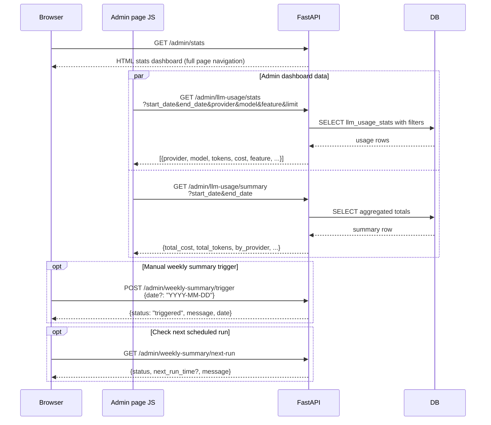

---

## Endpoint Reference

All 33 endpoints across 5 route files plus `main.py`:

### main.py
| Method | Path | Description |
|--------|------|-------------|
| GET | `/` | Main HTML page with injected `window.appConfig` |
| GET | `/vpn-status` | Check if client IP is within the WireGuard subnet |

### routes/stream.py
| Method | Path | Description |
|--------|------|-------------|
| POST | `/stream` | Start streaming a YouTube video |
| GET | `/audio/{video_id}` | Serve MP3 audio (range-request capable) |
| HEAD | `/audio/{video_id}` | Check if audio file is ready |
| POST | `/stop` | Stop the current stream |
| GET | `/status` | Streaming status + queue hash |
| GET | `/history` | Last N played videos |
| POST | `/history/clear` | Clear all play history |
| GET | `/playback-position/{video_id}` | Get saved position |
| POST | `/playback-position/{video_id}` | Save current position |
| DELETE | `/playback-position/{video_id}` | Clear saved position |
| GET | `/playback-positions` | Batch-fetch positions by video IDs |

### routes/queue.py
| Method | Path | Description |
|--------|------|-------------|
| POST | `/queue/add` | Add YouTube video to queue |
| GET | `/queue` | Get current queue |
| DELETE | `/queue/{queue_id}` | Remove one queue item |
| POST | `/queue/next` | Advance to next item in queue |
| POST | `/queue/clear` | Clear entire queue |
| POST | `/queue/reorder` | Reorder queue items |
| POST | `/queue/prefetch/{video_id}` | Pre-download next track audio |
| POST | `/queue/suggestions` | Generate and add smart suggestions |

### routes/transcription.py
| Method | Path | Description |
|--------|------|-------------|
| GET | `/transcription/status/{video_id}` | Get transcription job status |
| POST | `/transcription/start/{video_id}` | Manually trigger transcription |
| GET | `/transcription/summary/{video_id}` | Get summary text + Trilium link |

### routes/weekly_summaries.py
| Method | Path | Description |
|--------|------|-------------|
| GET | `/weekly-summaries` | List recent weekly summaries |
| GET | `/weekly-summaries/{week_year}/audio` | Stream weekly summary audio |
| POST | `/queue/add-summary/{week_year}` | Add weekly summary to queue |

### routes/admin.py
| Method | Path | Description |
|--------|------|-------------|
| GET | `/admin/stats` | HTML stats dashboard |
| POST | `/admin/weekly-summary/trigger` | Manually trigger weekly summary |
| GET | `/admin/weekly-summary/next-run` | Next scheduled summary run time |
| GET | `/admin/llm-usage/stats` | LLM usage records (filterable) |
| GET | `/admin/llm-usage/summary` | Aggregated LLM usage totals |
| POST | `/admin/client-logs` | Receive browser logs |
| GET | `/admin/client-logs` | Read recent browser logs |
| DELETE | `/admin/client-logs` | Clear browser logs |
